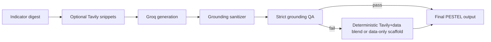

# Analysis Methods — Statistical and Strategic Methodology

**Document version:** 2026-07-20  
**Audience:** Analysts, researchers, product managers, engineers, and QA  
**Scope:** Business Analytics correlation, PESTEL, Porter Five Forces

---

## 1. Important limitation (read first)

**Correlation indicates association, not causation.** All statistical outputs in this platform are decision-support tools. Causal claims require independent validation beyond what the platform provides.

---

## 2. Business Analytics — Correlation and regression

The Business Analytics module analyzes the linear relationship between two selected metrics (`metricX`, `metricY`) across an inclusive year window for all countries with overlapping data.

**Endpoint:** `GET /api/analysis/correlation-global`  
**Narrative endpoint:** `POST /api/analysis/business/correlation-narrative`

### 2.1 Data points and missingness

| Rule | Description |
| --- | --- |
| Point definition | A country-year observation where **both** metric values exist (non-null) for the same year |
| Missing exclusion | Missing values are excluded — never imputed as zero in correlation computation |
| Year window | Inclusive loop from `start` to `end`, clamped to platform bounds (2000–current) |

### 2.2 Pearson correlation (r)

**Formula:**
```
r = cov(x, y) / (std(x) × std(y))
```

**Interpretation thresholds:**

| |r| range | Strength label |
| --- | --- |
| ≥ 0.7 | Strong |
| 0.4 – 0.7 | Moderate |
| 0.2 – 0.4 | Weak |
| < 0.2 | Negligible |

### 2.3 Linear regression

**Fitted line:**
```
y_fitted = intercept + slope × x
```

Where:
- `slope = r × sqrt(var(y) / var(x))` (when var(x) > 0)
- `intercept = mean(y) − slope × mean(x)`

### 2.4 Residuals

```
residual = y − y_fitted
```

Used for:
- Residual-vs-fitted scatter plot
- Residual distribution diagnostics (mean, median, IQR of residuals)
- Highlight country residual analysis in narrative payload

### 2.5 IQR outlier exclusion (optional)

When `excludeIqr=true`:

**For X:**
```
iqrX = q3x − q1x
outlier if x < q1x − 1.5×iqrX  OR  x > q3x + 1.5×iqrX
```

**For Y:** Same rule using q1y/q3y.

Points flagged in **either** X or Y are removed from computation. Count reported as `nIqrFlagged`.

### 2.6 Confidence band (ciBand)

Visualization aid using:
- `tCrit = 1.96`
- `mse = sse / (n − 2)`
- Standard error expression depending on x position relative to mean(x)

**Note:** The confidence band is a visualization/uncertainty aid — not a substitute for robust causal inference.

### 2.7 p-value approximation

```
t = r × sqrt(n−2) / sqrt(max(1e−20, 1−r²))
p = 2 × (1 − normalCdf(|t|))
```

### 2.8 Timeout resilience (serverless)

- Backend uses batched year processing with per-year fault tolerance
- Serverless concurrency: 8 years parallel (4 locally)
- Frontend reliability mode: automatic retry with narrower windows on timeout
- Strict mode: only selected range attempted; no fallback

### 2.9 Narrative generation constraints

When LLM narrative is generated:
- Language is **exploratory** — hypothesis guidance, not proof
- Correlation explicitly framed as association
- Residual diagnostics and regional subgroups included when available
- Deterministic fallback if LLM JSON shape/timeout gates fail

---

## 3. PESTEL methodology

**Endpoint:** `POST /api/analysis/pestel`  
**UI:** `frontend/src/pages/Pestel.tsx`

### 3.1 Input digest

1. Backend builds indicator digest from platform metrics for focus country + year
2. Optional Tavily web context retrieved as **snippet-only** evidence blocks
3. Digest keys mapped via `pestelDigestKeys.ts` to six PESTEL dimensions

### 3.2 Output structure

| Section | Content |
| --- | --- |
| Six dimensions | Political, Economic, Sociocultural, Technological, Environmental, Legal |
| SWOT grid | Strengths, Weaknesses, Opportunities, Threats (5 bullets each) |
| Comprehensive sections | Two-paragraph narrative blocks per strategic area |
| Market implications | Structured implications list |
| Recommendations | Action-oriented recommendations |

### 3.3 Quality pipeline



**Grounding QA thresholds:** Ratio and section-level checks in `pestelGrounding.ts`. Failure triggers deterministic replacement with attribution signal.

### 3.4 Fallback behavior

When Groq key missing or grounding QA fails:
- Data-only scaffold with stable JSON schema
- UI renders all sections without empty states
- Attribution indicates scaffold/fallback mode

---

## 4. Porter Five Forces methodology

**Endpoint:** `POST /api/analysis/porter`  
**UI:** `frontend/src/pages/Porter.tsx`

### 4.1 Input digest

1. Platform indicator digest for focus country + year
2. ILO-ISIC industry sector framing (`industrySector` field)
3. Optional Tavily web context for competitive/industry dynamics

### 4.2 Five forces output

| Force | Analysis focus |
| --- | --- |
| Threat of new entry | Barriers, capital requirements, regulatory environment |
| Supplier power | Input concentration, switching costs |
| Buyer power | Customer concentration, price sensitivity |
| Threat of substitutes | Alternative products/services, technology disruption |
| Competitive rivalry | Market concentration, growth rate, differentiation |

### 4.3 Fallback behavior

Same pattern as PESTEL: LLM when keys available and evidence passes gates; deterministic scaffold otherwise.

---

## 5. Method comparison summary

| Method | Statistical rigor | AI dependency | Primary output |
| --- | --- | --- | --- |
| Business correlation | High (Pearson r, regression, residuals) | Optional narrative only | Scatter plot + diagnostics + optional narrative |
| PESTEL | Medium (indicator digest + qualitative synthesis) | Required for full narrative; scaffold without | Structured strategic assessment |
| Porter | Medium (indicator digest + industry framing) | Required for full narrative; scaffold without | Five forces analysis by sector |

---

## 6. Related documents

| Document | Relationship |
| --- | --- |
| `docs/VARIABLES.md` | Derived variables (r, slope, residual, ciBand) |
| `docs/GUARDRAILS.md` | BG-02 (correlation ≠ causation), AG-06/AG-07 (PESTEL) |
| `docs/TRACEABILITY_MATRIX.md` | FR-09, FR-10, FR-13, FR-20 |
| `docs/DESIGN_GUIDELINES.md` | PESTEL/Porter theme colors |
| `docs/METRICS_AND_OKRS.md` | Quality KPIs for analysis modules |
