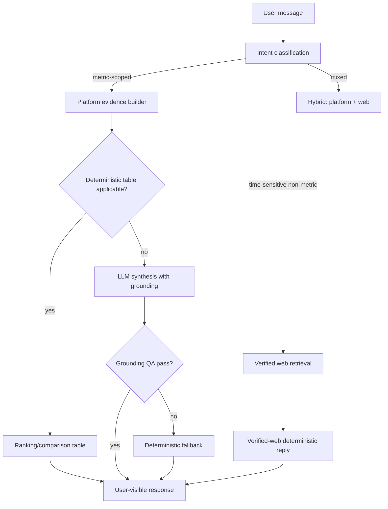

# Analytics Assistant — Behavior Specification

**Document version:** 2026-07-20  
**Audience:** Product managers, analysts, engineers, QA, and governance reviewers  
**Canonical code:** `backend/src/assistantIntel.ts`, `backend/src/index.ts` (`POST /api/assistant/chat`)

---

## 1. Purpose and scope

The Analytics Assistant helps users explore country intelligence through natural language. It is designed to:

- Answer **metric-scoped** ranking and comparison questions using deterministic platform evidence
- Support **time-sensitive non-metric** questions via verified live web retrieval (when configured)
- Generate **narrative prose** only when evidence quality gates pass
- **Never** present unsupported certainty — deterministic fallbacks are mandatory when evidence is thin

The assistant is **not** a general-purpose chatbot. It is a governed decision-support tool anchored to the platform's 68-metric catalog and explicit evidence boundaries.

---

## 2. Intent routing

The backend classifies each user message into an intent class. Classification determines eligible evidence sources, whether deterministic templates apply, and whether fallback paths activate.

| Intent class | Typical user question | Evidence mode | Deterministic path |
| --- | --- | --- | --- |
| `statistics_drill` | "Rank top 10 countries by GDP per capita" | Platform metrics | Yes — ranking table |
| `country_compare` | "Compare Indonesia and Brazil on population and life expectancy" | Platform metrics | Yes — comparison table with `% of top` |
| `country_overview` | "Give me an overview of Indonesia's economic indicators" | Platform metrics | Partial — digest + optional LLM |
| `general_web` | "Who is the current president of France?" | Verified web (Tavily) | Yes — verified-web deterministic path |

### Routing decision flow

---

## 3. Evidence model and citation discipline

The assistant uses two evidence streams:

| Stream | Internal tag | Source | Usage rule |
| --- | --- | --- | --- |
| Platform evidence | `[D#]` | Metric series, deterministic comparison/ranking tables | Must anchor all numeric metric claims |
| Web evidence | `[W#]` | Tavily retrieved excerpts | Must support only the specific claims cited; treated as excerpt text |

**Safety requirements:**
- Final user-visible output must **not** leak internal placeholder citation tokens (`[D#]`, `[W#]`)
- Assertions must align to evidence blocks; unsupported claims trigger fallback
- Web synthesis text from providers must not be treated as authoritative — only retrieved snippets

---

## 4. Deterministic paths vs LLM generation

### Deterministic paths (no LLM required)

Used when stable, auditable output is required:
- Ranking tables for metric-scoped global/country questions
- Comparison tables with `% of top` relative values
- Verified-web replies for time-sensitive non-metric questions

### LLM generation (Groq required)

Used for:
- Narrative synthesis and strategy-style prose when evidence quality gates pass
- Elaboration on platform evidence blocks when deterministic tables are insufficient

### Fallback activation

When evidence quality gates fail (missing keys, thin web context, grounding QA failure, drift detection):
- System returns deterministic scaffold/fallback output
- Fallback is **first-class**, not an error state
- Attribution signals indicate fallback mode to the user

---

## 5. Web routing modes

| Mode | Request field | Behavior |
| --- | --- | --- |
| Auto (balanced) | `webSearchPriority: false` | Platform metrics first; web only when needed |
| Web-first | `webSearchPriority: true` or `assistantMode: "web_priority"` | Biases toward live retrieval on every turn |

If Tavily keys are missing (server and BYOK), web-first behavior falls back safely to platform-only or scaffold responses.

---

## 6. BYOK key integration

Key resolution priority per request:
1. `X-User-Groq-Api-Key` / `X-User-Tavily-Api-Key` headers (from header panel)
2. Server environment keys (`GROQ_API_KEY`, `TAVILY_API_KEY`)
3. Deterministic fallback (no AI/web)

See `docs/VARIABLES.md` for header contracts and `docs/GUARDRAILS.md` (TG-04) for precedence rules.

---

## 7. Model selection and fallback chain

When LLM generation is enabled, the backend selects a primary Groq model per use case:

| Use case | Primary model (code default) | Env override |
| --- | --- | --- |
| Assistant | `llama-3.1-8b-instant` | `GROQ_MODEL_ASSISTANT` |
| PESTEL | `llama-3.3-70b-versatile` | `GROQ_MODEL_PESTEL` |
| Porter | `openai/gpt-oss-120b` | `GROQ_MODEL_PORTER` |
| Business | `llama-3.3-70b-versatile` | `GROQ_MODEL_BUSINESS` |

Fallback chain: per-use-case `GROQ_FALLBACK_MODELS_*` → global `GROQ_FALLBACK_MODELS` → built-in defaults.

---

## 8. Performance controls

- Prompt and context budgets clamped before LLM calls (`assistantPromptBudget.ts`)
- Metric fetch reduced to only what the question scope requires
- Serverless budget governed by `CAP_SERVERLESS_BUDGET_MS` (default 55s)

---

## 9. User-visible UX signals

| Signal | When shown | Purpose |
| --- | --- | --- |
| Persona banner | Every response | Category, persona name, brief description |
| Verified Web Answer Mode badge | Verified-web deterministic path | Indicates live web grounding was used |
| Routing label | Every response | "Dashboard" vs "Web search" vs other routing |
| Attribution footer | When fallback/scaffold used | Explains evidence mode and limitations |

These signals help users evaluate trust and provenance without inspecting system internals.

---

## 10. QA validation prompts (recommended benchmark set)

| Prompt | Expected behavior |
| --- | --- |
| "Rank Indonesia, Brazil, and India by GDP per capita" | Deterministic comparison table; `% of top` values |
| "Compare life expectancy trends for Japan and USA" | Metric-scoped response; no drift to unrelated indicators |
| "Who is the current president of Indonesia?" | Verified-web path with citation; or fallback if web thin |
| "What is the GDP of Atlantis?" | Graceful handling; no fabricated data |
| (With Groq key removed) "Summarize Indonesia economy" | Deterministic scaffold or platform-only digest |

---

## 11. Related documents

| Document | Relationship |
| --- | --- |
| `docs/GUARDRAILS.md` | AG-01 through AG-07 AI safety boundaries |
| `docs/VARIABLES.md` | Request/response variables for `/api/assistant/chat` |
| `docs/TRACEABILITY_MATRIX.md` | FR-04 through FR-08, FR-18, FR-19 |
| `docs/API_REFERENCE.md` | Endpoint contract |
| `docs/USER_STORIES.md` | Stories A1–A4 acceptance criteria |
