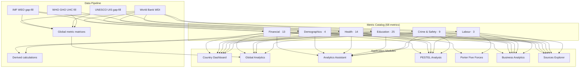

# Metric Catalog (Platform Indicator Dictionary)

This document is the platform’s beginner-friendly “single dictionary” for every indicator metric the application can display or use in analysis.

Canonical source: `backend/src/metrics.ts` (implementation-aligned with `backend/dist/metrics.js`).

## What is a “metric” here?

A metric is a standardized numeric indicator with:
- A technical Metric ID (used in API payloads)
- A human-friendly label (used in charts/tables/UI)
- A unit (required for interpretation)
- A known origin (World Bank WDI primary, with controlled gap-fill/enrichment)
- Optional derived formulas (for derived metrics)

In this product, metrics power:
- Dashboard KPI cards and trend charts
- Global tables and world aggregate series
- Analytics Assistant ranking/comparison grounding
- PESTEL/Porter digests (indicator “digest” scaffolding)
- Business Analytics correlation and narrative interpretation

## How to use this catalog (quick guide)

1. Start with the Metric ID (left column).
2. Check the unit (right column) before comparing countries or years.
3. Treat “missing values” as missing, not as zero (the backend may fill gaps, but not always).
4. If the metric is derived, use the formula for interpretation discipline.

## Field meanings in the table

- Metric ID: technical key used in API calls and UI selection
- Friendly Name: display label
- Unit: the unit used for values (rates, percentages, absolute counts, indexes, etc.)
- Category: conceptual grouping for UI and analysis context
- World Bank Code: WDI indicator code used as primary source
- Fallback WB Code: alternate WDI indicator code used when primary is missing (when applicable)
- Formula (when derived): only shown for metrics explicitly derived in the platform
- Source summary (short): short description of origin and fill behavior

### Gap-fill fields (available via `GET /api/metrics`, not in table below)

Many metrics support controlled gap-fill beyond the primary WDI code. These fields appear in the API response and `backend/src/metrics.ts`:

| Field | Friendly Name | Definition | Example |
| --- | --- | --- | --- |
| `imfWeoIndicator` | IMF WEO Indicator ID | IMF DataMapper series used to fill null WDI years | `NGDPD` (GDP in billions US$) |
| `imfWeoScale` | IMF Scale Multiplier | Multiplier applied to IMF values (e.g. `1e9` for billions) | `1000000000` |
| `uisIndicatorId` | UNESCO UIS Indicator ID | UIS API series used for education gap-fill | `LR.GALP.AG15T99` (adult literacy) |

**Special-case WHO GHO fill (not a catalog field):** metric `uhc_service_coverage` merges WHO Global Health Observatory `UHC_INDEX_REPORTED` after WDI when the live WDI series is archived. Implementation: `backend/src/whoGho.ts` + `globalData/composeMetricMatrix.ts`.
| `shortLabel` | Chart Short Label | Compact display name computed at runtime | `GDP per capita` |

For the complete machine-readable catalog including gap-fill fields, call `GET /api/metrics` or read `backend/src/metrics.ts`.

## Category summary (68 metrics across 6 data categories)

The platform uses **6 metric categories** in the catalog plus **1 UI-only global table grouping** (`general`):

| Category | Metric count | Primary use in app | Key source institutions |
| --- | --- | --- | --- |
| financial | 13 | Dashboard accordion, global financial table, Business Analytics | World Bank WDI, IMF WEO |
| demographics | 4 | Dashboard accordion, global general table | World Bank WDI, IMF WEO |
| health | 14 | Dashboard accordion, global health table | World Bank WDI (WHO/UNICEF) |
| education | 25 | Dashboard accordion, global education table | World Bank WDI, UNESCO UIS |
| labour | 3 | Dashboard accordion, global general table | World Bank WDI / ILO |
| crime | 9 | Dashboard safety accordion, global crime table, choropleth map | UNODC, IDMC, UCDP, World Bank WGI |
| general (UI only) | — | Global table grouping for cross-domain composite views — not a metric category | Multiple |

## Metric relationship chart

This chart shows how metric categories connect to application modules and analysis flows.

### Derived metric dependencies

| Derived metric | Depends on | Formula |
| --- | --- | --- |
| `gdp_per_capita` | `gdp`, `population` | GDP / Population |
| `gdp_per_capita_ppp` | `gdp_ppp`, `population` | GDP (PPP) / Population |
| `gov_debt_usd` | `gov_debt_pct_gdp`, `gdp` | (Debt % GDP / 100) × GDP (nominal US$) |

## Full metric list (68 metrics)

| Metric ID | Friendly Name | Unit | Category | World Bank Code | Fallback WB Code | Formula (when derived) | Source summary (short) |
| --- | --- | --- | --- | --- | --- | --- | --- |
| `gdp` | GDP (Nominal, US$) | US$ | financial | NY.GDP.MKTP.CD | — | GDP = C + I + G + (X − M) | Gross domestic product in current US dollars. |
| `gdp_per_capita` | GDP per capita (Nominal, US$) | US$ | financial | NY.GDP.PCAP.CD | — | GDP per capita = GDP / Population | GDP divided by midyear population. |
| `gdp_growth` | GDP growth (annual %) | % | financial | NY.GDP.MKTP.KD.ZG | — | — | Annual percentage growth rate of GDP at constant prices. |
| `population` | Population, total | people | demographics | SP.POP.TOTL | — | — | Total population based on census and WPP estimates. |
| `gov_debt_pct_gdp` | Central government debt, total (% of GDP) | % of GDP | financial | GC.DOD.TOTL.GD.ZS | GC.DOD.TOTL.CN | Debt / GDP × 100 | Debt of central government as share of GDP (WDI). |
| `inflation` | Inflation, consumer prices (annual %) | % | financial | FP.CPI.TOTL.ZG | — | — | Inflation from WDI consumer price index. |
| `interest_real` | Real interest rate (%) | % | financial | FR.INR.RINR | — | — | Real interest rate from World Bank WDI where reported. |
| `unemployment_ilo` | Unemployment, total (% of labour force) — modeled ILO | % | labour | SL.UEM.TOTL.ZS | SL.UEM.TOTL.NE.ZS | — | Share of labour force without work but available. |
| `poverty_headcount` | Poverty headcount ratio at $2.15 a day (2017 PPP) | % | financial | SI.POV.DDAY | — | — | Population living below international poverty line. |
| `life_expectancy` | Life expectancy at birth, total (years) | years | health | SP.DYN.LE00.IN | — | — | Average years a newborn would live under current mortality. |
| `mortality_under5` | Mortality rate, under-5 (per 1,000 live births) | per 1,000 | health | SH.DYN.MORT | — | — | Probability of dying before age five per 1,000 births. |
| `literacy_adult` | Literacy rate, adult total (% ages 15+) | % | education | SE.ADT.LITR.ZS | — | — | Adult literacy from UIS via WDI. |
| `school_primary_completion` | Primary completion rate, total (% of relevant age group) | % | education | SE.PRM.CMPT.ZS | — | — | WDI uses gross intake ratio to last grade of primary; UIS gap-fill uses CR.1. |
| `enrollment_secondary` | School enrollment, secondary (% gross) | % | education | SE.SEC.ENRR | — | — | Total secondary enrollment regardless of age. |
| `teachers_primary` | Pupil-teacher ratio, primary | pupils per teacher | education | SE.PRM.ENRL.TC.ZS | — | — | Average pupils per teacher in primary education. |
| `labour_force_participation` | Labor force participation rate, total (% pop 15+) | % | labour | SL.TLF.ACTI.ZS | — | — | Proportion of working-age population in labour force. |
| `pop_age_0_14` | Population ages 0-14 (% of total) | % | demographics | SP.POP.0014.TO.ZS | — | — | Youth dependency proxy — share under 15. |
| `pop_age_65_plus` | Population ages 65+ (% of total) | % | demographics | SP.POP.65UP.TO.ZS | — | — | Aging indicator — share 65 and older. |
| `gdp_ppp` | GDP (PPP, Intl$) | Intl$ | financial | NY.GDP.MKTP.PP.CD | — | GDP (PPP) = GDP × PPP conversion factor | GDP converted to international dollars using PPP rates. |
| `gdp_per_capita_ppp` | GDP per capita (PPP, Intl$) | Intl$ | financial | NY.GDP.PCAP.PP.CD | — | GDP per capita (PPP) = GDP (PPP) / Population | GDP per person in international dollars (PPP). |
| `gni_per_capita_atlas` | GNI per capita, Atlas method (current US$) | US$ | financial | NY.GNP.PCAP.CD | — | — | GNI per person using the Atlas method. |
| `gov_debt_usd` | Central government debt, total (current US$) | US$ | financial | GC.DOD.TOTL.CD | — | Debt (US$) ≈ (Debt % GDP / 100) × GDP (nominal US$) when direct WDI level is missing | Debt estimate when direct WDI level is missing. |
| `lending_rate` | Lending interest rate (%) | % | financial | FR.INR.LEND | — | — | Bank lending rate to prime borrowers. |
| `poverty_national` | Poverty headcount ratio at national poverty lines (% of population) | % | financial | SI.POV.NAHC | — | — | Population below national poverty lines. |
| `maternal_mortality` | Maternal mortality ratio (per 100,000 live births) | per 100,000 | health | SH.STA.MMRT | — | — | Annual number of maternal deaths per 100,000 live births. |
| `undernourishment` | Prevalence of undernourishment (% of population) | % | health | SN.ITK.DEFC.ZS | — | — | Population in a state of undernourishment. |
| `birth_rate` | Birth rate, crude (per 1,000 people) | per 1,000 | health | SP.DYN.CBRT.IN | — | — | Annual live births per 1,000 population (midyear estimate). |
| `tb_incidence` | Incidence of tuberculosis (per 100,000 people) | per 100,000 | health | SH.TBS.INCD | — | — | Estimated new and relapse TB cases per 100,000 population. |
| `uhc_service_coverage` | UHC service coverage index (0-100) | index | health | SH.UHC.SRVS.CV.XD | — | — | Universal health coverage service coverage index (SDG 3.8.1). Live WDI series is archived; platform fills from WHO GHO `UHC_INDEX_REPORTED` (see Sources / `who-gho` provider). |
| `hospital_beds` | Hospital beds (per 1,000 people) | per 1,000 | health | SH.MED.BEDS.ZS | — | — | Hospital beds available per 1,000 people. |
| `physicians_density` | Physicians (per 1,000 people) | per 1,000 | health | SH.MED.PHYS.ZS | — | — | Medical doctors per 1,000 people. |
| `nurses_midwives_density` | Nurses and midwives (per 1,000 people) | per 1,000 | health | SH.MED.NUMW.P3 | — | — | Nurses and midwives per 1,000 people. |
| `immunization_dpt` | Immunization, DPT (% of children ages 12-23 months) | % | health | SH.IMM.IDPT | — | — | Share of children who received DPT immunization. |
| `immunization_measles` | Immunization, measles (% of children ages 12-23 months) | % | health | SH.IMM.MEAS | — | — | Share of children who received measles immunization. |
| `health_expenditure_gdp` | Current health expenditure (% of GDP) | % of GDP | health | SH.XPD.CHEX.GD.ZS | — | — | Current health expenditure as a share of GDP. |
| `smoking_prevalence` | Smoking prevalence, total (ages 15+) | % | health | SH.PRV.SMOK | — | — | Prevalence of current tobacco smoking among people ages 15+. |
| `oosc_primary` | Out-of-school rate for children of primary school age (%) | % | education | SE.PRM.OOSC.ZS | — | — | Share of primary-school-age children out of school. |
| `oosc_secondary` | Out-of-school rate for adolescents of lower secondary school age (%) | % | education | SE.SEC.OOSC.ZS | — | — | Share of lower-secondary-age adolescents out of school. |
| `oosc_tertiary` | Out-of-school rate for youth of upper secondary school age (%) | % | education | SE.TER.OOSC.ZS | — | — | Share of upper-secondary-age youth out of school. |
| `completion_secondary` | Lower secondary completion rate, total (% of relevant age group) | % | education | SE.SEC.CMPT.ZS | — | — | Gross completion ratio for lower secondary. |
| `completion_tertiary` | Gross graduation ratio, tertiary education | % | education | SE.TER.GRAD.ZS | — | — | Tertiary graduation ratio. |
| `reading_proficiency` | Learning poverty: reading (%) | % | education | SE.LPV.PRIM | — | — | Share below minimum reading proficiency. |
| `gpi_primary` | GPI proxy — primary school enrollment gender parity index | index | education | SE.ENR.PRIM.FM.ZS | — | — | Ratio of female to male gross primary enrollment. |
| `gpi_secondary` | GPI proxy — secondary enrollment gender parity index | index | education | SE.ENR.SEC.FM.ZS | — | — | Ratio of female to male gross secondary enrollment. |
| `gpi_tertiary` | GPI proxy — tertiary enrollment gender parity index | index | education | SE.ENR.TER.FM.ZS | — | — | Ratio of female to male gross tertiary enrollment. |
| `trained_teachers_pri` | Trained teachers in primary education (% of total teachers) | % | education | SE.PRM.TCAQ.LO.GE.ZS | — | — | Share of primary teachers meeting training standards. |
| `trained_teachers_sec` | Trained teachers in lower secondary education (% of total teachers) | % | education | SE.SEC.TCAQ.LO.GE.ZS | — | — | Share of lower secondary teachers meeting training standards. |
| `trained_teachers_ter` | Trained teachers in upper secondary education (% of total teachers) | % | education | SE.TER.TCAQ.LO.GE.ZS | — | — | Share of upper secondary teachers meeting training standards. |
| `edu_expenditure_gdp` | Government expenditure on education, total (% of GDP) | % of GDP | education | SE.XPD.TOTL.GD.ZS | — | — | Public spending on education as share of GDP. |
| `enrollment_primary_pct` | School enrollment, primary (% gross) | % | education | SE.PRM.ENRR | — | — | Gross primary enrollment ratio. |
| `enrollment_tertiary_pct` | School enrollment, tertiary (% gross) | % | education | SE.TER.ENRR | — | — | Gross tertiary enrollment ratio. |
| `enrollment_primary_count` | Enrolment in primary education (number) | people | education | SE.PRM.ENRL | — | — | Total students enrolled in primary education. |
| `enrollment_secondary_count` | Enrolment in secondary education (number) | people | education | SE.SEC.ENRL | — | — | Total students enrolled in secondary education. |
| `enrollment_tertiary_count` | Enrolment in tertiary education (number) | people | education | SE.TER.ENRL | — | — | Total students enrolled in tertiary education. |
| `teachers_primary_count` | Teachers in primary education, total | people | education | SE.PRM.TCHR | — | — | Total teachers in primary education. |
| `teachers_secondary_count` | Teachers in secondary education, total | people | education | SE.SEC.TCHR | — | — | Total teachers in secondary education. |
| `teachers_tertiary_count` | Teachers in tertiary education programmes, total | people | education | SE.TER.TCHR | — | — | Total teachers in tertiary education. |
| `pop_15_64_pct` | Population ages 15-64 (% of total) | % | demographics | SP.POP.1564.TO.ZS | — | — | Working-age population share. |
| `labor_force_total` | Labor force, total | people | labour | SL.TLF.TOTL.IN | — | — | Total economically active population. |
| `homicide_rate` | Intentional homicides (per 100,000 people) | per 100,000 | crime | VC.IHR.PSRC.P5 | — | — | UNODC intentional homicide rate via WDI (SDG 16.1.1). |
| `homicide_rate_female` | Intentional homicides, female (per 100,000 female) | per 100,000 | crime | VC.IHR.PSRC.FE.P5 | — | — | Female intentional homicide rate (UNODC via WDI). |
| `homicide_rate_male` | Intentional homicides, male (per 100,000 male) | per 100,000 | crime | VC.IHR.PSRC.MA.P5 | — | — | Male intentional homicide rate (UNODC via WDI). |
| `gbv_women_pct` | Women subjected to physical and/or sexual violence in last 12 months (% of ever-partnered women ages 15-49) | % | crime | SG.VAW.1549.ZS | — | — | Intimate-partner violence prevalence from UN/WHO surveys via WDI. |
| `idp_conflict_violence` | Internally displaced persons, new displacement associated with conflict and violence (number of cases) | cases | crime | VC.IDP.NWCV | — | — | New conflict/violence IDP cases (IDMC via WDI). |
| `battle_related_deaths` | Battle-related deaths (number of people) | people | crime | VC.BTL.DETH | — | — | Organized armed-conflict fatalities (UCDP via WDI). |
| `rule_of_law_wgi` | Rule of Law — governance estimate (approx. -2.5 to +2.5) | index | crime | GOV_WGI_RL_EST | — | — | Perceptions of rule adherence and crime enforcement (World Bank WGI). |
| `political_stability_wgi` | Political Stability — governance estimate (approx. -2.5 to +2.5) | index | crime | GOV_WGI_PV_EST | — | — | Likelihood of violence/terror destabilizing government (WGI). |
| `corruption_control_wgi` | Control of Corruption — governance estimate (approx. -2.5 to +2.5) | index | crime | GOV_WGI_CC_EST | — | — | Extent public power is exercised for private gain (WGI). |

## Maintenance rule

If the metric set changes in `backend/src/metrics.ts`, this file must be updated in the same release to keep metric IDs and formula notes synchronized.
